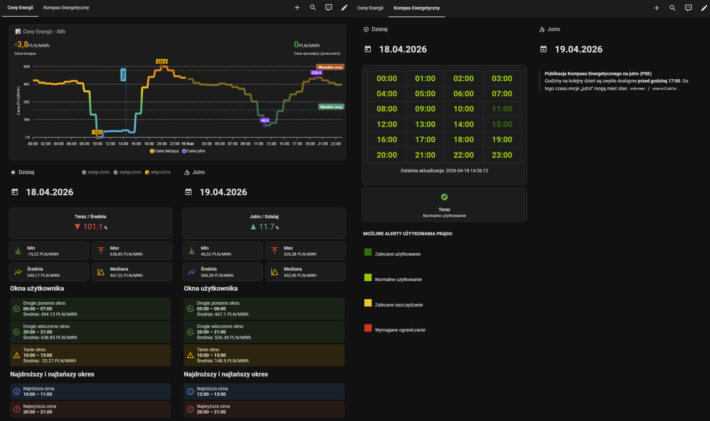

# Integracja RCE PSE do Home Assistant

[](https://github.com/hacs/integration)


[](https://github.com/lewa-reka/ha-rce-pse/releases/latest)
[](https://spdx.org/licenses/AGPL-3.0-or-later.html)


## Rynkowa Cena Energii

Integracja monitoruje polskie ceny rynkowe energii (RCE) publikowane przez PSE. Dane mają rozdzielczość 15 minut, integracja odpytuje API co 30 minut. Ceny na jutro publikowane są przez PSE zwykle po 14:00. Drugie źródło danych to raport PDGSZ (Kompas Energetyczny) z rekomendacją PSE co do użytkowania energii w danej godzinie.

Prezentacja i instalacja: <https://youtu.be/6N71uXgf9yc>

## Przykładowy dashboard Lovelace



Gotowy plik YAML: [examples/dashboard-lovelace-PL.yaml](examples/dashboard-lovelace-PL.yaml). Zawiera dwa widoki — **Ceny Energii** (wykres 48h, kolumny Dziś i Jutro) oraz **Kompas Energetyczny** (siatka godzin PDGSZ, legenda alertów).

Wymagania:

- Karta **ApexCharts Card** zainstalowana z HACS (`custom:apexcharts-card`).
- Widok typu **Sekcje** w pulpicie Home Assistant.
- Integracja w trybie pełnym (nie Lite) — wszystkie użyte encje muszą istnieć.

Plik korzysta z polskich `entity_id`. Przy HA po angielsku podmień identyfikatory

## Instalacja

[](https://my.home-assistant.io/redirect/hacs_repository/?owner=Lewa-Reka&repository=ha-rce-pse&category=integration)

### HACS (zalecane)

1. Otwórz HACS w Home Assistant.
2. Wyszukaj **RCE PSE**.
3. Pobierz integrację.
4. Zrestartuj Home Assistant.

### Instalacja ręczna

1. Skopiuj folder `custom_components/rce_pse` do katalogu `custom_components` w Home Assistant.
2. Zrestartuj Home Assistant.

### Pierwsza konfiguracja

[](https://my.home-assistant.io/redirect/config_flow_start/?domain=rce_pse)

1. **Ustawienia** → **Integracje**.
2. **Dodaj integrację** → wyszukaj **RCE PSE**.
3. Ustaw opcje cenowe, tryb Lite, okna czasowe i progi cenowe.
4. **Zapisz**.

## Spis treści

- [Konfiguracja](#konfiguracja)
- [Sensory](#sensory)
- [Kompas Energetyczny (PDGSZ)](#kompas-energetyczny-pdgsz)
- [Binary sensory](#binary-sensory)
- [Debugowanie](#debugowanie)
- [Źródło danych](#źródło-danych)
- [Migracja z v1.x do v2.0.0](docs/MIGRACJA-V2.md)
- [Licencja](#licencja)
- [Współpraca](#współpraca)

## Konfiguracja

Formularz konfiguracji dzieli się na sekcje: podstawowe ustawienia, okno tanich godzin, okno drogich godzin, drugie okno drogich godzin, progi cenowe.

### Tryb Lite

Domyślnie wyłączony. Po włączeniu integracja publikuje wyłącznie cztery sensory: **Cena**, **Cena Jutro**, **Kompas Energetyczny Dzisiaj** i **Kompas Energetyczny Jutro**. Statystyki, sensory poprzedniego i następnego okresu, wszystkie okna konfigurowalne, wszystkie sensory progów cenowych oraz wszystkie binary sensory są wtedy wyłączone razem z ich obliczeniami. Pełne dane PSE (dziś i jutro) zostają w atrybucie sensora **Cena** i **Cena Jutro** do własnych szablonów.

### Jednostka ceny

Pole **Jednostka** przyjmuje `PLN/MWh` (domyślnie) lub `PLN/kWh`. Ta sama jednostka obowiązuje dla wszystkich sensorów i progów. Po przełączeniu PLN/MWh ↔ PLN/kWh historia w recorderze może mieszać stare i nowe próbki przy tym samym `entity_id` — zaktualizuj progi i automatyzacje. Konwersja z MWh na kWh odbywa się w koordynatorze przez podzielenie wartości API przez 1000; sensory zaokrąglają do 2 miejsc po przecinku, w `raw_data` jest wyższa precyzja wewnętrzna.

### Średnie ceny godzinowe

Domyślnie **wyłączone**. Po włączeniu każda godzina dostaje średnią z czterech kwadransów PSE i ta sama wartość trafia do wszystkich czterech przedziałów 15-minutowych w danej godzinie. Tryb przydatny w rozliczeniach net-billing, gdzie liczniki prosumenckie raportują z dokładnością do godziny mimo cen 15-minutowych (Art. 4b ust. 11 Ustawy o OZE). Po wyłączeniu sensory pracują na surowych cenach 15-minutowych z API.

### Ceny brutto (z VAT)

Domyślnie **wyłączone** — ceny pozostają w wartościach netto z API. Po włączeniu integracja mnoży ceny przez `1.23` (stawka 23%), zanim dane trafią do sensorów i zanim nastąpi konwersja jednostki. Wszystkie sensory cenowe automatycznie pokazują wartości brutto.

Sensor **Cena Sprzedaży Prosument** (`sensor.rce_pse_cena_sprzedazy_prosument`) zawsze ceny ujemne sprowadza do 0 dla każdego 15 minutowgo okresu. W trybie `Cen netto` dolicza VAT nawet gdy inne wartości go nie mają. Sensor ten może zwracać wartości dodatnie nawet jeśli dana godzina przez główny sensor `Cena` prezentowania jest ujemnie. Wynika to ze sposobu rozliczania prosumentów w przypadku rozbieżności między okresami publikowanych cen a odczytami z liczników.

### Okna tanie / drogie / drugie drogie

Każde z trzech okien ma własny przełącznik włączenia, **Początek przeszukiwania** (HH:MM), **Koniec przeszukiwania** (HH:MM) i **Długość poszukiwanego okna** (HH:MM). Skok wartości to 15 minut. Po wyłączeniu przełącznika integracja nie publikuje sensorów ani binary sensora dla tego okna i nie wykonuje obliczeń.

Semantyka zakresów:

- Zakres przeszukiwania mieści się w jednym dniu kalendarzowym.
- **00:00** w polu **Koniec przeszukiwania** oznacza koniec tego samego dnia (ostatni kwadrans przypisany do dnia w danych PSE), nie północ na początku dnia.
- Para `00:00 → 00:00` przeszukuje cały dzień.
- **Długość okna** to ciągły blok kwadransów (od `00:15` do `24:00`); nie może być dłuższa niż zakres przeszukiwania.

Domyślne wartości:

- Tanie i drogie okno: początek `00:00`, koniec `00:00`, długość `02:00`.
- Drugie drogie okno: początek `06:00`, koniec `10:00`, długość `02:00`.

### Progi cenowe

Sekcja **Progi cenowe** zawiera **Próg niskiej ceny** (domyślnie `0`) i **Próg wysokiej ceny** (domyślnie `1000`). Każdy próg ma własny przełącznik włączenia. Progi podaj w tej samej jednostce co **Jednostka ceny**.

Sensory timestamp **Cena Poniżej / Powyżej Progu Początek** i **Koniec** pokazują okno aktualnie trwające (kwadrans po kwadransie z ceną ≤ progu niskiego albo ≥ progu wysokiego). Jeśli takiego okna nie ma, sensory wskazują najbliższe przyszłe okno spośród rekordów dziś i jutra (jutro tylko gdy PSE już opublikuje dane). Brak trwającego i przyszłego okna → stan `unknown`.

Binary sensor **Cena Poniżej / Powyżej Progu Aktywna** reaguje wyłącznie na bieżącą cenę (tę samą wartość co sensor **Cena**), niezależnie od logiki okien timestampów.

### Zmiana ustawień

**Ustawienia** → **Integracje** → **RCE PSE** → **Konfiguruj**. Po zapisaniu integracja przeładuje się z nowymi ustawieniami. Encje na chwilę mogą być niedostępne.

## Sensory

Tabele poniżej używają polskich `entity_id` — Home Assistant w polskiej wersji generuje je ze slugowanej polskiej nazwy. W angielskiej wersji UI te same encje mają slugi angielskie (np. `sensor.rce_pse_price` zamiast `sensor.rce_pse_cena`); zasada jest ta sama, tłumaczy się tylko nazwa wyświetlana. Ceny zaokrąglane są do 2 miejsc po przecinku. Tryb Lite ogranicza listę do **Cena**, **Cena Jutro**, **Kompas Energetyczny Dzisiaj** i **Kompas Energetyczny Jutro**.

### Cena bieżąca i prosument

| `entity_id` PL | Nazwa PL | `entity_id` EN | Nazwa EN | Opis |
| --- | --- | --- | --- | --- |
| `sensor.rce_pse_cena` | Cena | `sensor.rce_pse_price` | Price | Aktualna cena energii dla bieżącego okresu; atrybut `raw_data` zawiera wszystkie kwadranse na dziś. |
| `sensor.rce_pse_cena_sprzedazy_prosument` | Cena Sprzedaży Prosument | `sensor.rce_pse_prosumer_selling_price` | Prosumer Selling Price | Cena sprzedaży prosumenta: ujemne wartości sprowadzone do 0; w trybie netto VAT 23% doliczany lokalnie, w trybie brutto bez podwójnego VAT. |

### Cena sąsiedniego okresu

Długość okresu wynika z opcji **Średnie ceny godzinowe**: 15 min przy surowych kwadransach, 1 h przy średnich godzinowych.

| `entity_id` PL | Nazwa PL | `entity_id` EN | Nazwa EN |
| --- | --- | --- | --- |
| `sensor.rce_pse_cena_nastepny_okres` | Cena Następny Okres | `sensor.rce_pse_next_period_price` | Next Period Price |
| `sensor.rce_pse_cena_poprzedni_okres` | Cena Poprzedni Okres | `sensor.rce_pse_previous_period_price` | Previous Period Price |

### Statystyki dzisiaj

| `entity_id` PL | Nazwa PL | `entity_id` EN | Nazwa EN |
| --- | --- | --- | --- |
| `sensor.rce_pse_srednia_cena_dzisiaj` | Średnia Cena Dzisiaj | `sensor.rce_pse_average_price_today` | Average Price Today |
| `sensor.rce_pse_maksymalna_cena_dzisiaj` | Maksymalna Cena Dzisiaj | `sensor.rce_pse_maximum_price_today` | Maximum Price Today |
| `sensor.rce_pse_minimalna_cena_dzisiaj` | Minimalna Cena Dzisiaj | `sensor.rce_pse_minimum_price_today` | Minimum Price Today |
| `sensor.rce_pse_mediana_cen_dzisiaj` | Mediana Cen Dzisiaj | `sensor.rce_pse_median_price_today` | Median Price Today |
| `sensor.rce_pse_aktualna_vs_srednia_dzisiaj` | Aktualna vs Średnia Dzisiaj | `sensor.rce_pse_current_vs_average_today` | Current vs Average Today |

### Statystyki jutro

Dostępne, gdy PSE opublikuje dane na następny dzień (zwykle po 14:00).

| `entity_id` PL | Nazwa PL | `entity_id` EN | Nazwa EN |
| --- | --- | --- | --- |
| `sensor.rce_pse_cena_jutro` | Cena Jutro | `sensor.rce_pse_price_tomorrow` | Price Tomorrow |
| `sensor.rce_pse_srednia_cena_jutro` | Średnia Cena Jutro | `sensor.rce_pse_average_price_tomorrow` | Average Price Tomorrow |
| `sensor.rce_pse_maksymalna_cena_jutro` | Maksymalna Cena Jutro | `sensor.rce_pse_maximum_price_tomorrow` | Maximum Price Tomorrow |
| `sensor.rce_pse_minimalna_cena_jutro` | Minimalna Cena Jutro | `sensor.rce_pse_minimum_price_tomorrow` | Minimum Price Tomorrow |
| `sensor.rce_pse_mediana_cen_jutro` | Mediana Cen Jutro | `sensor.rce_pse_median_price_tomorrow` | Median Price Tomorrow |
| `sensor.rce_pse_jutro_vs_dzisiaj_srednia` | Jutro vs Dzisiaj Średnia | `sensor.rce_pse_tomorrow_vs_today_average` | Tomorrow vs Today Average |

### Najwyższa i najniższa cena w dniu (timestamp)

Wszystkie zwracają datetime. Do wyświetlenia HH:MM użyj `as_timestamp(...) | timestamp_custom('%H:%M')`.

| `entity_id` PL | Nazwa PL | `entity_id` EN | Nazwa EN |
| --- | --- | --- | --- |
| `sensor.rce_pse_najnizsza_cena_dzisiaj_poczatek` | Najniższa Cena Dzisiaj Początek | `sensor.rce_pse_lowest_price_today_start` | Lowest Price Today Start |
| `sensor.rce_pse_najnizsza_cena_dzisiaj_koniec` | Najniższa Cena Dzisiaj Koniec | `sensor.rce_pse_lowest_price_today_end` | Lowest Price Today End |
| `sensor.rce_pse_najwyzsza_cena_dzisiaj_poczatek` | Najwyższa Cena Dzisiaj Początek | `sensor.rce_pse_highest_price_today_start` | Highest Price Today Start |
| `sensor.rce_pse_najwyzsza_cena_dzisiaj_koniec` | Najwyższa Cena Dzisiaj Koniec | `sensor.rce_pse_highest_price_today_end` | Highest Price Today End |
| `sensor.rce_pse_najnizsza_cena_jutro_poczatek` | Najniższa Cena Jutro Początek | `sensor.rce_pse_lowest_price_tomorrow_start` | Lowest Price Tomorrow Start |
| `sensor.rce_pse_najnizsza_cena_jutro_koniec` | Najniższa Cena Jutro Koniec | `sensor.rce_pse_lowest_price_tomorrow_end` | Lowest Price Tomorrow End |
| `sensor.rce_pse_najwyzsza_cena_jutro_poczatek` | Najwyższa Cena Jutro Początek | `sensor.rce_pse_highest_price_tomorrow_start` | Highest Price Tomorrow Start |
| `sensor.rce_pse_najwyzsza_cena_jutro_koniec` | Najwyższa Cena Jutro Koniec | `sensor.rce_pse_highest_price_tomorrow_end` | Highest Price Tomorrow End |

### Tanie okno (konfigurowalne)

| `entity_id` PL | Nazwa PL | `entity_id` EN | Nazwa EN |
| --- | --- | --- | --- |
| `sensor.rce_pse_tanie_okno_dzisiaj_poczatek` | Tanie Okno Dzisiaj Początek | `sensor.rce_pse_cheap_window_today_start` | Cheap Window Today Start |
| `sensor.rce_pse_tanie_okno_dzisiaj_koniec` | Tanie Okno Dzisiaj Koniec | `sensor.rce_pse_cheap_window_today_end` | Cheap Window Today End |
| `sensor.rce_pse_tanie_okno_jutro_poczatek` | Tanie Okno Jutro Początek | `sensor.rce_pse_cheap_window_tomorrow_start` | Cheap Window Tomorrow Start |
| `sensor.rce_pse_tanie_okno_jutro_koniec` | Tanie Okno Jutro Koniec | `sensor.rce_pse_cheap_window_tomorrow_end` | Cheap Window Tomorrow End |
| `sensor.rce_pse_tanie_okno_srednia_cena_dzisiaj` | Tanie Okno Średnia Cena Dzisiaj | `sensor.rce_pse_cheap_window_avg_price_today` | Cheap Window Avg Price Today |
| `sensor.rce_pse_tanie_okno_srednia_cena_jutro` | Tanie Okno Średnia Cena Jutro | `sensor.rce_pse_cheap_window_avg_price_tomorrow` | Cheap Window Avg Price Tomorrow |

### Drogie okno (konfigurowalne)

| `entity_id` PL | Nazwa PL | `entity_id` EN | Nazwa EN |
| --- | --- | --- | --- |
| `sensor.rce_pse_drogie_okno_dzisiaj_poczatek` | Drogie Okno Dzisiaj Początek | `sensor.rce_pse_expensive_window_today_start` | Expensive Window Today Start |
| `sensor.rce_pse_drogie_okno_dzisiaj_koniec` | Drogie Okno Dzisiaj Koniec | `sensor.rce_pse_expensive_window_today_end` | Expensive Window Today End |
| `sensor.rce_pse_drogie_okno_jutro_poczatek` | Drogie Okno Jutro Początek | `sensor.rce_pse_expensive_window_tomorrow_start` | Expensive Window Tomorrow Start |
| `sensor.rce_pse_drogie_okno_jutro_koniec` | Drogie Okno Jutro Koniec | `sensor.rce_pse_expensive_window_tomorrow_end` | Expensive Window Tomorrow End |
| `sensor.rce_pse_drogie_okno_srednia_cena_dzisiaj` | Drogie Okno Średnia Cena Dzisiaj | `sensor.rce_pse_expensive_window_avg_price_today` | Expensive Window Avg Price Today |
| `sensor.rce_pse_drogie_okno_srednia_cena_jutro` | Drogie Okno Średnia Cena Jutro | `sensor.rce_pse_expensive_window_avg_price_tomorrow` | Expensive Window Avg Price Tomorrow |

### Drugie drogie okno (konfigurowalne)

| `entity_id` PL | Nazwa PL | `entity_id` EN | Nazwa EN |
| --- | --- | --- | --- |
| `sensor.rce_pse_drugie_drogie_okno_dzisiaj_poczatek` | Drugie Drogie Okno Dzisiaj Początek | `sensor.rce_pse_second_expensive_window_today_start` | Second Expensive Window Today Start |
| `sensor.rce_pse_drugie_drogie_okno_dzisiaj_koniec` | Drugie Drogie Okno Dzisiaj Koniec | `sensor.rce_pse_second_expensive_window_today_end` | Second Expensive Window Today End |
| `sensor.rce_pse_drugie_drogie_okno_jutro_poczatek` | Drugie Drogie Okno Jutro Początek | `sensor.rce_pse_second_expensive_window_tomorrow_start` | Second Expensive Window Tomorrow Start |
| `sensor.rce_pse_drugie_drogie_okno_jutro_koniec` | Drugie Drogie Okno Jutro Koniec | `sensor.rce_pse_second_expensive_window_tomorrow_end` | Second Expensive Window Tomorrow End |
| `sensor.rce_pse_drugie_drogie_okno_srednia_cena_dzisiaj` | Drugie Drogie Okno Średnia Cena Dzisiaj | `sensor.rce_pse_second_expensive_window_avg_price_today` | Second Expensive Window Avg Price Today |
| `sensor.rce_pse_drugie_drogie_okno_srednia_cena_jutro` | Drugie Drogie Okno Średnia Cena Jutro | `sensor.rce_pse_second_expensive_window_avg_price_tomorrow` | Second Expensive Window Avg Price Tomorrow |

### Okna progowe

Sensory pokazują okno trwające albo najbliższe przyszłe, uwzględniając łącznie dane na dziś i jutro. Brak trwającego i przyszłego okna → stan `unknown`.

| `entity_id` PL | Nazwa PL | `entity_id` EN | Nazwa EN |
| --- | --- | --- | --- |
| `sensor.rce_pse_cena_ponizej_progu_poczatek` | Cena Poniżej Progu Początek | `sensor.rce_pse_price_below_threshold_start` | Price Below Threshold Start |
| `sensor.rce_pse_cena_ponizej_progu_koniec` | Cena Poniżej Progu Koniec | `sensor.rce_pse_price_below_threshold_end` | Price Below Threshold End |
| `sensor.rce_pse_cena_powyzej_progu_poczatek` | Cena Powyżej Progu Początek | `sensor.rce_pse_price_above_threshold_start` | Price Above Threshold Start |
| `sensor.rce_pse_cena_powyzej_progu_koniec` | Cena Powyżej Progu Koniec | `sensor.rce_pse_price_above_threshold_end` | Price Above Threshold End |

## Kompas Energetyczny (PDGSZ)

Dwa sensory korzystają z raportu PDGSZ pobieranego z `https://api.raporty.pse.pl/api/pdgsz`:

- `sensor.rce_pse_kompas_energetyczny_dzisiaj` — Kompas Energetyczny Dzisiaj (EN: `sensor.rce_pse_energy_compass_today` / Energy Compass Today).
- `sensor.rce_pse_kompas_energetyczny_jutro` — Kompas Energetyczny Jutro (EN: `sensor.rce_pse_energy_compass_tomorrow` / Energy Compass Tomorrow).

Stan sensora to rekomendacja PSE dla bieżącej godziny. Możliwe stany (tekst w języku UI):

- **Zalecane użytkowanie** (`recommended_usage`)
- **Normalne użytkowanie** (`normal_usage`)
- **Zalecane oszczędzanie** (`recommended_saving`)
- **Wymagane ograniczenie** (`required_restriction`)

Atrybut `values` zawiera listę rekordów z API (`dtime`, `usage_fcst`, `business_date`) wzbogaconych o klucze `state` i `display_state`. Sensor Jutro ma dane wyłącznie wtedy, gdy PSE już je opublikuje (zachowanie jak przy **Cena Jutro**); w przeciwnym razie stan `unknown`.

## Binary sensory

| `entity_id` PL | Nazwa PL | `entity_id` EN | Nazwa EN | Stan `on` gdy |
| --- | --- | --- | --- | --- |
| `binary_sensor.rce_pse_najnizsza_cena_aktywna` | Najniższa Cena Aktywna | `binary_sensor.rce_pse_lowest_price_active` | Lowest Price Active | Trwa okres najniższej ceny dnia wg danych PSE. |
| `binary_sensor.rce_pse_najwyzsza_cena_aktywna` | Najwyższa Cena Aktywna | `binary_sensor.rce_pse_highest_price_active` | Highest Price Active | Trwa okres najwyższej ceny dnia wg danych PSE. |
| `binary_sensor.rce_pse_tanie_okno_aktywne` | Tanie Okno Aktywne | `binary_sensor.rce_pse_cheap_window_active` | Cheap Window Active | Aktualny czas mieści się w skonfigurowanym tanim oknie. |
| `binary_sensor.rce_pse_drogie_okno_aktywne` | Drogie Okno Aktywne | `binary_sensor.rce_pse_expensive_window_active` | Expensive Window Active | Aktualny czas mieści się w skonfigurowanym drogim oknie. |
| `binary_sensor.rce_pse_drugie_drogie_okno_aktywne` | Drugie Drogie Okno Aktywne | `binary_sensor.rce_pse_second_expensive_window_active` | Second Expensive Window Active | Aktualny czas mieści się w drugim drogim oknie. |
| `binary_sensor.rce_pse_cena_ponizej_progu_aktywna` | Cena Poniżej Progu Aktywna | `binary_sensor.rce_pse_price_below_threshold_active` | Price Below Threshold Active | Bieżąca cena (jak w sensorze **Cena**) ≤ progowi niskiemu. |
| `binary_sensor.rce_pse_cena_powyzej_progu_aktywna` | Cena Powyżej Progu Aktywna | `binary_sensor.rce_pse_price_above_threshold_active` | Price Above Threshold Active | Bieżąca cena (jak w sensorze **Cena**) ≥ progowi wysokiemu. |

## Debugowanie

Włącz logi debugowe integracji w `configuration.yaml`:

```yaml
logger:
  default: info
  logs:
    custom_components.rce_pse: debug
```

Zrestartuj Home Assistant. Logi sprawdź w **Ustawienia** → **Logi** lub bezpośrednio w pliku `home-assistant.log`. W trybie debug widać żądania do API PSE, status odpowiedzi, kroki config flow oraz błędy i ostrzeżenia.

## Źródło danych

Integracja korzysta z oficjalnego API PSE pod adresem `https://api.raporty.pse.pl/api`, odświeżanie co 30 minut.

- **`rce-pln`** — ceny RCE w PLN/MWh, rozdzielczość 15 minut. Pobierane pola: `dtime`, `period`, `rce_pln`, `business_date`. Ceny na jutro publikowane są zwykle po 14:00.
- **`pdgsz`** — godziny szczytu z rekomendacją `usage_fcst`. Pobierane pola: `business_date`, `dtime`, `is_active`, `usage_fcst`.

## Migracja z v1.x

Wpis konfiguracyjny migruje się automatycznie (okna z wartości godzinowych na format HH:MM, jednostka cen). Pełna lista zmian niekompatybilnych wstecz: [docs/MIGRACJA-V2.md](docs/MIGRACJA-V2.md).

## Licencja

Projekt na licencji [GNU Affero General Public License w wersji 3 lub nowszej](https://spdx.org/licenses/AGPL-3.0-or-later.html) (SPDX: `AGPL-3.0-or-later`) — pełny tekst w pliku [LICENSE](LICENSE). To **zmiana** licencji w v2.0.0 (wcześniej Apache 2.0).

## Współpraca

Pull Requesty mile widziane. Przy większych zmianach najpierw otwórz issue. Trzymaj się standardów projektu.
